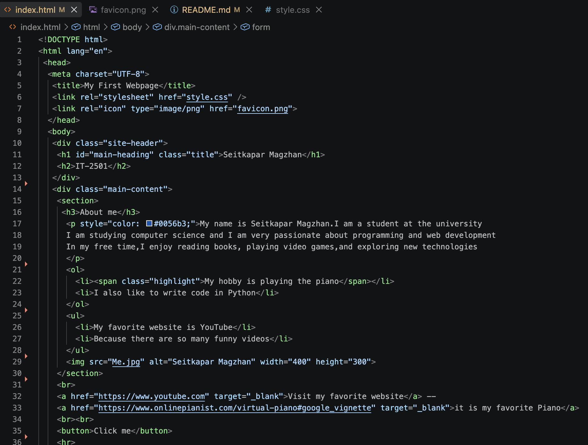
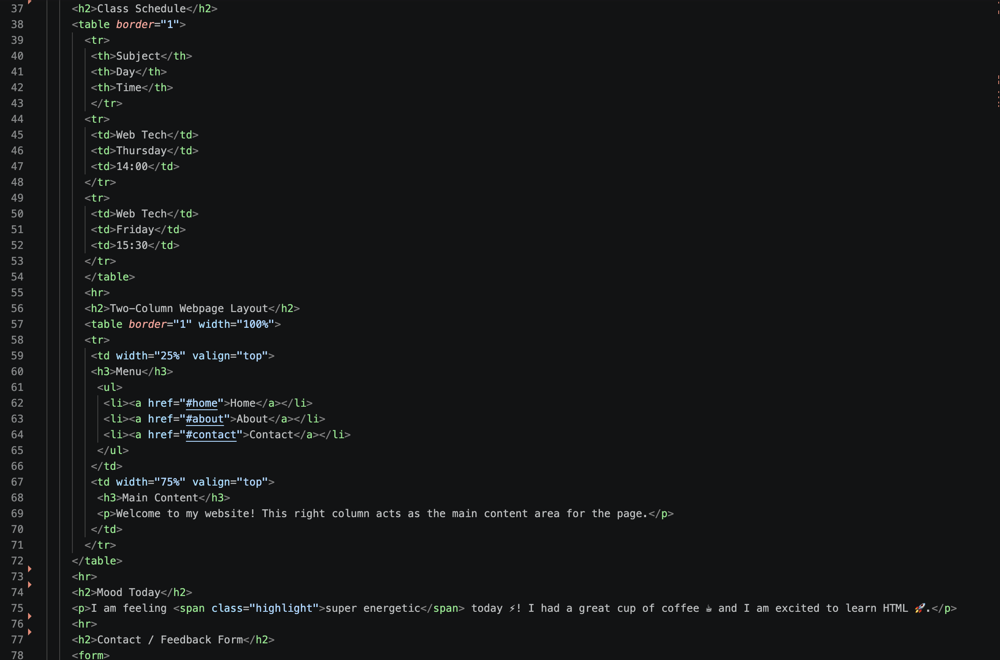
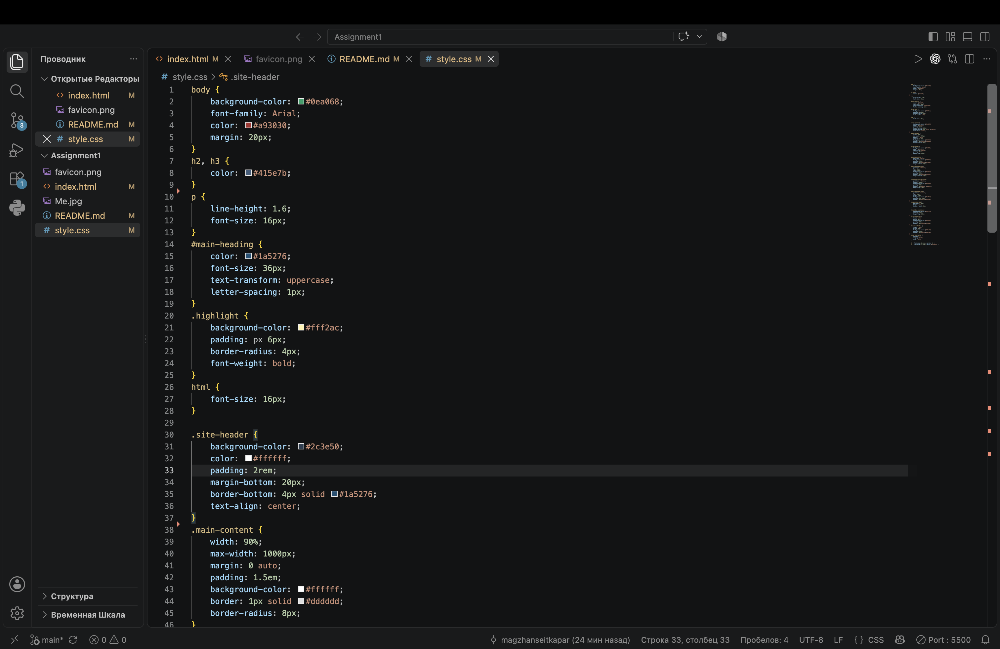
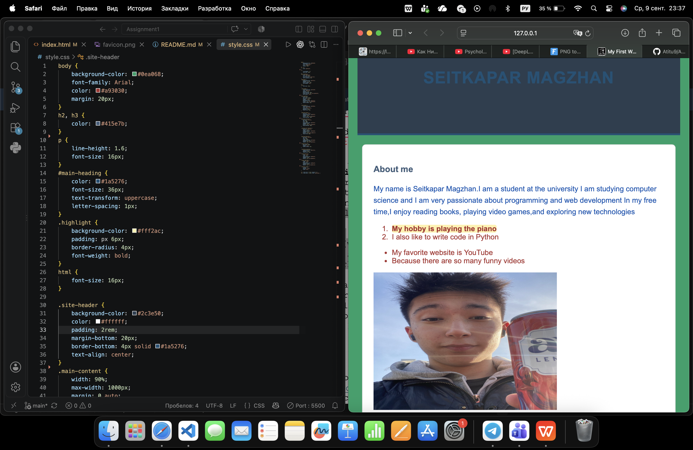

# Assignment 1: Web Development Basics (HTML & CSS)

## Student Information
* **Name:** Seitkapar Magzhan
* **Group:** IT-2501

---

## Assignment Parts & Tasks

### Part 1. Introduction to HTML
* **Step 0:** HTML Boilerplate and title ("My First Webpage").
* **Step 1:** Structured text using headings (`<h1>`-`<h3>`) and paragraph (`
`).
* **Step 2:** Created ordered (`<ol>`) and unordered (`<ul>`) lists.
* **Step 3:** Inserted image (``) and external links (`<a>`).
* **Step 4:** Added an interactive button (`<button>`).

#### Screenshot — Part 1

---

### Part 2. Intermediate HTML
* **Step 5:** Built a class schedule table with 3 columns ("Subject", "Day", "Time").
* **Step 6:** Implemented a two-column layout using table elements.
* **Step 7:** Included emojis inside a paragraph describing mood today.
* **Step 8:** Created an HTML feedback form with text, email, color inputs, and submit button.

#### Screenshot — Part 2

---

### Part 3. Introduction to CSS
* **Step 9 & 12:** Applied styling via External CSS (`style.css`).
* **Step 10:** Used inline CSS for specific paragraph styling.
* **Step 11:** Configured global page styles (background, font families, text color).
* **Step 13 & 14:** Utilized Element, ID (`#main-heading`), and Class (`.highlight`) selectors.

#### Screenshot — Part 3

---

### Part 4. Intermediate CSS
* **Step 15:** Added a custom website favicon (`favicon.png`).
* **Step 16:** Grouped structure using `
` elements (`site-header`, `main-content`).
* **Step 17:** Applied Box Model properties (`margin`, `padding`, `border`).
* **Step 18:** Configured CSS positioning (`static`, `relative`, `absolute`).
* **Step 19:** Utilized flexible sizing units (`px`, `%`, `em`, `rem`).
* **Step 20:** Implemented floated boxes with `clearfix` reset.
* **Step 21:** Published the final site on GitHub Pages.

#### Screenshot — Part 4

---

## Brief Summary of Work Process
1. **HTML Structure:** Started by building the semantic skeleton of the document, adding personal details, lists, images, tables, and form inputs.
2. **CSS Styling:** Connected an external stylesheet to style headers, text colors, and background highlights. Configured classes and IDs to distinguish unique elements.
3. **Layout & Positioning:** Organized the content using layout container `
` tags. Experimented with Box Model spacing, relative and absolute positioning, and float layouts.
4. **Publishing:** Linked the project to a remote Git repository in VS Code and deployed the website using GitHub Pages.